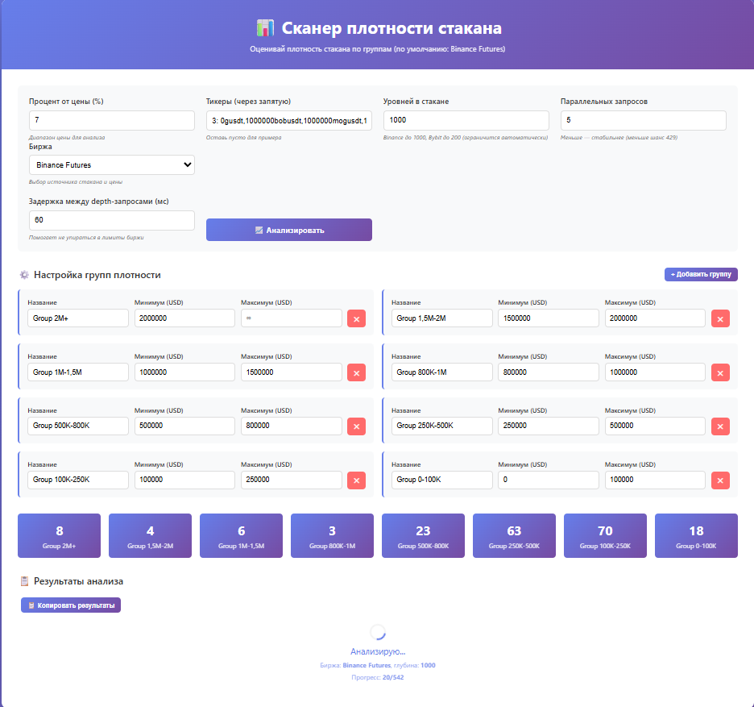
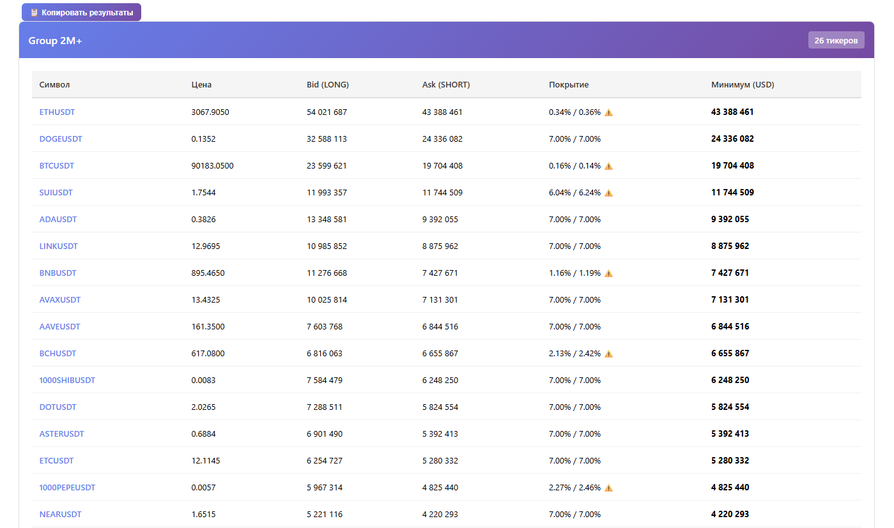
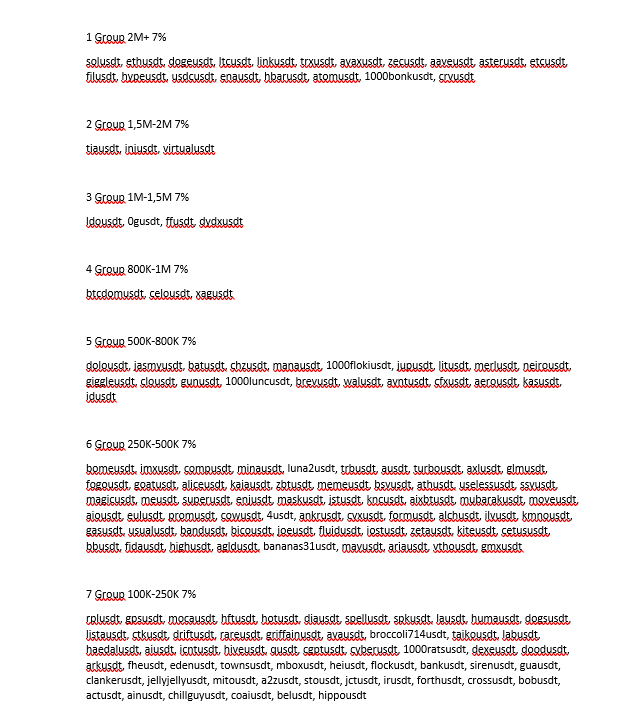

# OrderBook Density Scanner

Веб-сканер, который анализирует **фьючерсные стаканы** и распределяет монеты по **реальной ликвидности внутри диапазона ±X% от цены**.

Работает прямо в браузере — один HTML-файл, без сервера.

Автор: https://t.me/nothinice1  

---

## Что делает сканер

Сканер проходит по всем фьючерсным тикерам и для каждого:

1. Загружает стакан (bids и asks)
2. Вычисляет **mid-price**:
   (bestBid + bestAsk) / 2
3. Считает объёмы (в USD) в коридоре ±X%:
   - **Bids (LONG, зелёная часть)**  
     от `mid × (1 − X%)` до `mid`
   - **Asks (SHORT, красная часть)**  
     от `mid` до `mid × (1 + X%)`
4. Итоговая ликвидность:
   `min(bidLiquidity, askLiquidity)`

Это консервативная метрика — она показывает, где **обе стороны стакана плотные**.

---

## Группировка рынков по ликвидности

Сканер не просто считает объёмы — он **автоматически распределяет тикеры по группам ликвидности**.

Ты можешь задать собственные диапазоны, например:
- 0 – 250k
- 250k – 1M
- 1M – 5M
- 5M+

После запуска анализа все монеты будут разложены по этим группам в зависимости от глубины их стакана внутри ±X%.

Это позволяет:
- находить **тонкие рынки**
- и **защищённые рынки**

---

## Удобный список тикеров

Для каждой группы сканер формирует **готовый список тикеров**.

Внизу таблицы есть кнопка **Copy**, которая копирует строку вида:
`BTCUSDT, ETHUSDT, XRPUSDT, ADAUSDT, ...`

Это удобно для:
- TradingView
- торговых ботов
- фильтрации рынков
- ручного трейдинга

---

## Coverage (покрытие диапазона)

Публичные API бирж не отдают полный стакан.  
Они возвращают только ограниченное число уровней.

Сканер показывает:
`CoverageDown / CoverageUp`

Это означает, какую часть диапазона ±X% реально покрывают доступные данные.

| Coverage | Значение |
|--------|--------|
| 2.00% / 2.00% | Полный диапазон |
| 0.35% / 0.40% ⚠️ | Частичное покрытие |

На BTC и ETH это часто < 1% — это нормальное ограничение API.

---

## Поддерживаемые биржи

- Binance USDT-M Futures  
- Bybit Linear USDT Futures  

---

## Ошибки 429

Если появляется:
`HTTP 429 – Too many requests`

Это лимит биржи. Используйте:
- Параллельность: 3–5  
- Задержка: 80–200 мс  

---

## Как использовать

**Локально**
- Скачать `index.html`
- Открыть в браузере

**Онлайн**
https://nothinice.github.io/orderbook-density-scanner/

---

## Примеры

---

## Важно

Это инструмент анализа ликвидности.  
Не финансовый совет.

Используйте его для поиска:
- защищённых уровней
- зон манипуляций
- реальной глубины рынка
